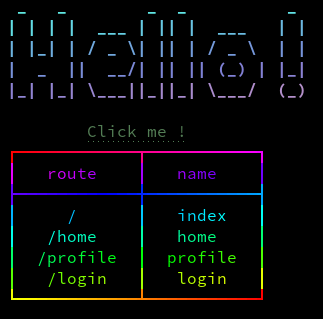

# QTerm

🐱 Make your console.log() looks cute 👶



## Installation :

npm :
`npm install qterm`

yarn :
`yarn add qterm`

## Available methods :

**table** :
```javascript
import { table } from 'qterm';

table(arr, styles);
```
**title** :
```javascript
import { title } from 'qterm';

title(text, styles);
```
**text**
```javascript
import { text } from 'qterm';

text(text, styles);
```

**link**
```javascript
import { link } from 'qterm';

link(text, link, styles)
```

## Styling :

**Change text color :**

```javascript
title("Awesome CLI", "text-red");
text("Another text", "text-blue");
text("Custom font", "text[#02D]");
```
**Change background color :**

```javascript
title("Awesome CLI", "bg-red");
text("Another text", "bg-blue");
text("Custom font", "bg[#02F]");
```

**Add margins :**

```javascript
title("Awesome CLI", "ml-4");
text("Another text", "mt-2");
text("Custom font", "mb-1");
```

**Change font style :**

```javascript
title("Awesome CLI", "font-bold");
text("Another text", "font-italic");
text("Custom font", "font-underline");
```

**Use font gradient :**

```javascript
title("Awesome CLI", "gradient-mind");
text("Another text", "gradient-rainbow");
text("Custom font", "gradient-vice");
```

## Title font list :
You can set fonts for the title method, you can retrieve the complete list of available font for titles : https://github.com/patorjk/figlet.js/tree/master/fonts

## Gradient list :

**Built-in gradients :**
[](http://bit.ly/2ufX07r)


### Dependencies :
- chalk
- figlet
- gradient-string
- terminal-link
